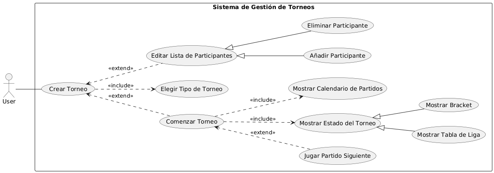
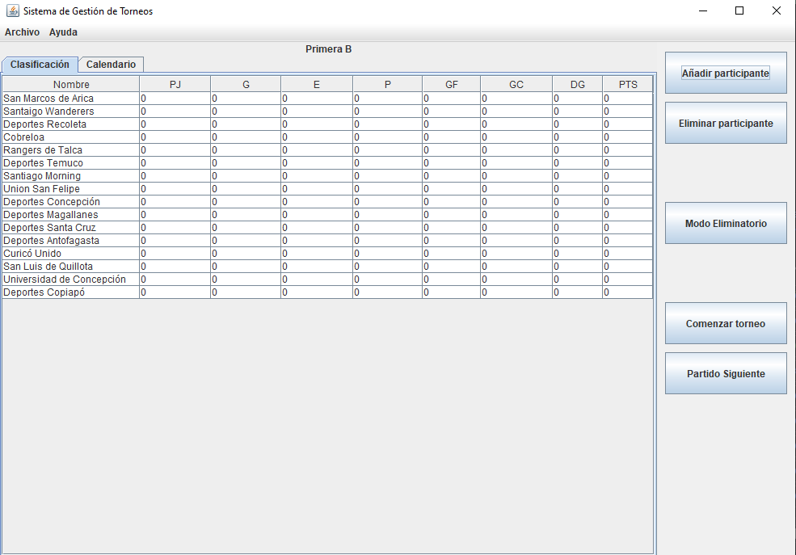
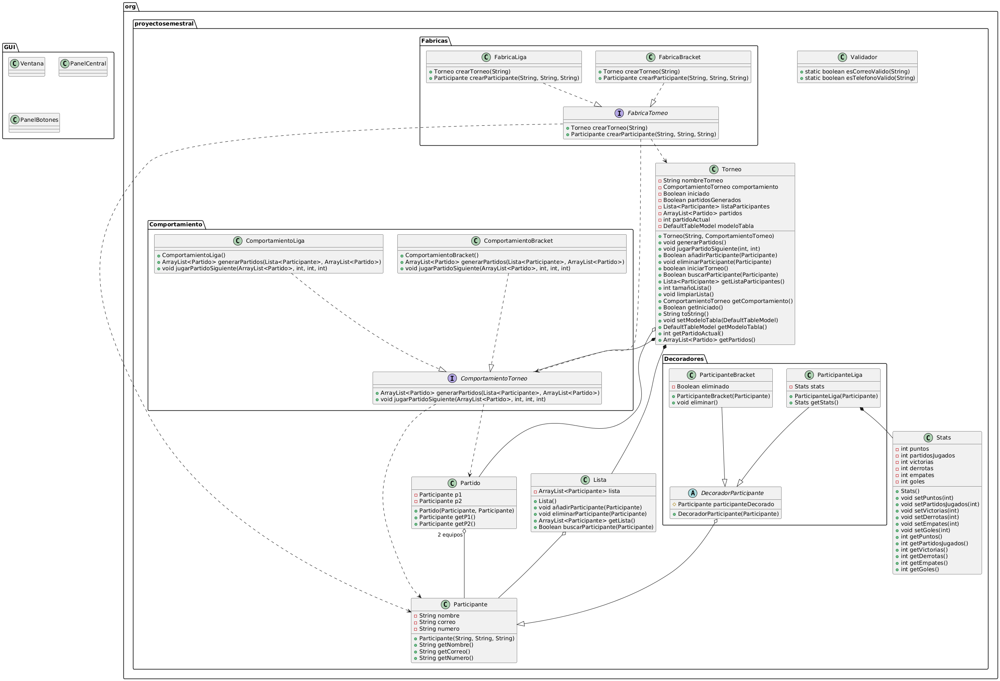
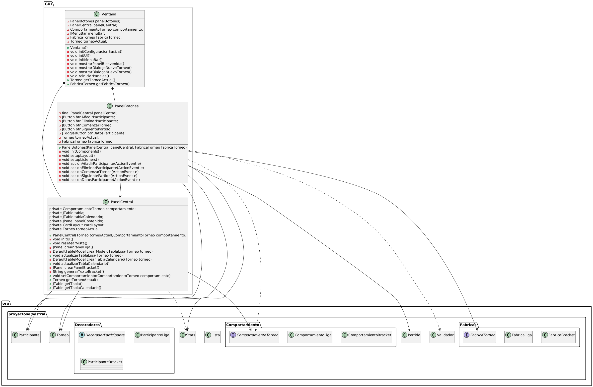

# Grupo 20 - Desarrollo Orientado a Objeto

## Integrantes

### Diego Benjamin Arriagada Proboste-2023900281

### Matias Ignacio Catril Perez-2024402170

### Victor Fernando Galaz Garrido-2024431005

# Enunciado

## Sistema de Gestión de Torneos

Este sistema está diseñado para facilitar la organizacíon de torneos deportivos o de juegos. Permitirá a un organizador definir las características del torneo, como el nombre, la disciplina (ej. fútbol, ajedrez, videojuegos), las fechas y un formato principal (como eliminatoria directa, eliminatorio doble, liga simple...). Se podrán inscribir participantes, ya sean jugadores individuales o equipos, almacenando información básica como nombres y datos de contacto. El sistema deberá ser capaz de generar un calendario de enfrentamientos o un bracket inicial basado en los inscritos y el formato. Durante el torneo, se registrarán los resultados de cada enfrentamiento, lo que actualizará automáticamente las posiciones, el avance en el bracket o las tablas de clasificación. Los usuarios podrán visualizar el estado actual del torneo, los próximos encuentros y las estadísticas generales.

# Diagrama de Casos de Uso

# Captura de Interfaz

# Diagrama de Clases UML
## Parte Logica

## Parte Grafica

# Patrones de Diseño Utilizados

## Patrón Strategy
Se utilizó el patron Strategy para definir los comportamientos de los diferentes formatos de torneo, especificamente para el formato de eliminación directa (bracket) y el formato de liga. 
Cada formato implementa una interfaz común que define cómo se generan los enfrentamientos y cómo se registran los resultados.

### Clases
- #### ComportamientoTorneo: Interfaz general para los comportamientos de los torneos.
- #### ComportamientoBracket: Implementación del comportamiento para torneos de eliminación directa.
- #### ComportamientoLiga: Implementación del comportamiento para torneos de liga.

## Patrón Decorator
Se utilizó el patron Decorator para añadir funcionalidades adicionales a los participantes del torneo, como la posibilidad de agregar Stats (formato liga) o información adicional sin modificar la clase base.

### Clases
- #### DecoradorParticipante: Clase abstracta que define el molde para los decoradores de participantes.
- #### ParticipanteBracket: Clase concreta que representa a un participante en un torneo de eliminación directa, añadiendo un booleano para indicar si ha sido eliminado y un método para eliminar al participante.
- #### ParticipanteLiga: Clase concreta que representa a un participante en un torneo de liga, añadiendo la posibilidad de agregar Stats a cada participante siguiendo el formato de liga.

## Patrón Factory Method
Se utilizó el patron Factory Method en la parte lógica para crear instancias de los participantes y torneos sin acoplar el código a las clases concretas.
En la parte gráfica, se utilizón el patrón para crear botones mediante un método de fábrica, permitiendo una mayor flexibilidad y reutilización del código.

### Clases
- #### FabricaTorneo: Clase abstracta que define el método de creación de torneos.
- #### FabricaLiga: Implementación de la fábrica para crear torneos de liga y añadir participantes.
- #### FabricaBracket: Implementación de la fábrica para crear torneos de eliminación directa y añadir participantes.

# Decisiones Importantes
El principal cambio en el proyecto respecto al enunciado original fue la decisión relativamente tardía de implementar un programa exclusivamente centrado a torneos de fútbol en lugar de un sistema más genérico. 
Esto no llevó necesariamente a una reestructuración completa del código mismo, pero si implicó replantear algunas de las clases y sus relaciones, 
así como la lógica de negocio para adaptarse a las reglas y dinámicas del fútbol. Similarmente, 
la decisión nos proveyó de la libertad de implementar un sistema más específico y detallado, 
lo que permitió una mayor profundidad en la funcionalidad del programa y, finalmente, un programa con el que nos sentimos mas cómodos trabajando.

Más allá de esa decisión, es importante mencionar la planificacíon inicial del proyecto donde se definieron los patrones de diseño que adoptaríamos a lo largo del proyecto, 
tanteando con la idea de usar el Event Dispatch Thread (EDT) de Java para manejar la interfaz gráfica, 
pero finalmente optamos por un enfoque más sencillo y directo, 
utilizando un JFrame y JPanel para la visualización del torneo y sus participantes, 
así como los patrones de diseño ya mencionados en la sección anterior.

Finalmentem, no se realizaron cambios extremadamente importantes respecto al enunciado original, mas que nada debido a la ambigedad y libertad que ofrecía como marco inicial,
lo cual fue precisamente uno de los motivos para elegirlo en el primer lugar. Fuera de la deicison principal respecto a especializar el programa en torneos de futbol con dos formatos,
no hubo cambios significativos en la estructura del proyecto.

# Problemas Identificados y Autocrítica
El proyecto, en general, se desarrolló de manera fluida y sin mayores inconvenientes, sin embargo, no deja de ser posible identificar algunas áreas de mejora y problemas que podrían haberse evitado.
El principal punto que se podría haber mejorado es el ritmo de trabajo y frecuencia de reuniones del grupo, ya que si bien se lograron cumplir los plazos establecidos, es fácil notar que, incluso con la fecha de entrega extendida, se podría haber terminado el trabajo con mucha mayor antelación, lo que habríá permitido una revisión más exhaustiva del código y la implementación de funcionalidades adicionales que no se pudieron realizar por falta de tiempo. Esto también habría permitido una mejor planificación y organización del trabajo, evitando la sensación de apuro al final del proyecto.
Naturalmente, no sería justo culpar del todo a los integrantes del grupo por este problema, 
ya que la carga académica de cada uno de nosotros fue bastante alta durante el semestre, 
lo que dificultó la dedicación al proyecto. En ese sentido, se trataría de un problema más
relacionado a las circunstancias mismas que a una falta de compromiso o responsabilidad.

Similarmente al problema anterior, la frecuencia de reuniones del grupo podrían haber sido mas frecuentes y/o mas profundas, una observación que es fácil de ver en la distribución de los commits en Github a lo largo del tiempo, esencialmente sirviendo como evidencia de la relativa falta de avances frecuentes en pos de realizar cambios mas exhaustivos en cortos periodos de tiempo, una mala practica que podria llevar a complicaciones al hacer el avance menos modular y mas concentrado en pocas actualizaciones.

Finalmente, se nota una ligera irregularidad en la distribucion del trabajo entre los integrantes del grupo, ya que si bien todos aportaron al proyecto e invirtieron aporximadamente la misma cantidad de tiempo, nuestro compañero Diego Arriagada se merece una especial mención al haber cargado con el principal grueso del trabajo a nivel de código puro. En ese sentido, se podría decir que la distribución de los roles de trabajo no fueron del todo iguales dependiendo del punto de vista, habiendose optado por una modularidad mas marcada donde algunos miembros trabajaron casi exclusivamente fuera del codigo mismo, pero siempre dentro del proyecto e invirtiendo tiempo en el mismo.
Esto no es necesariamente un problema, pero si es importante mencionarlo para una mejor autocrítica y reflexión sobre el trabajo en equipo.